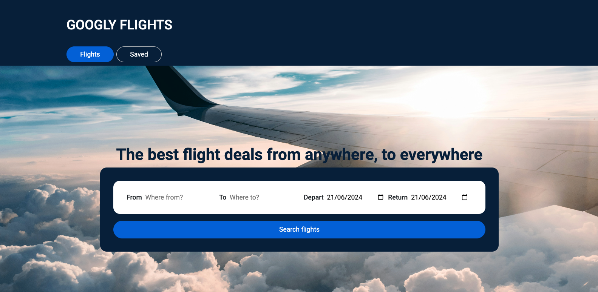
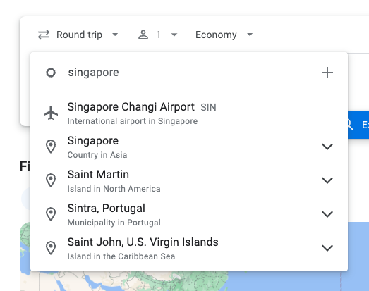
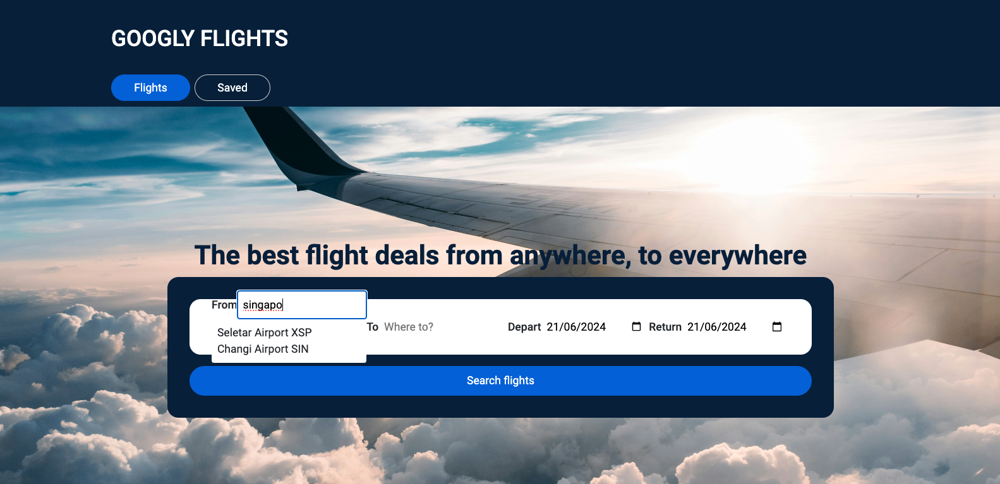
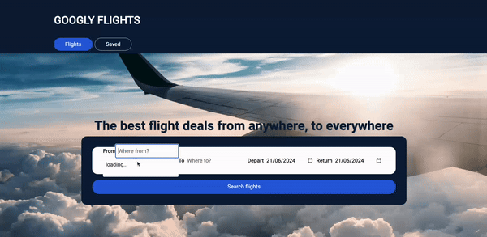
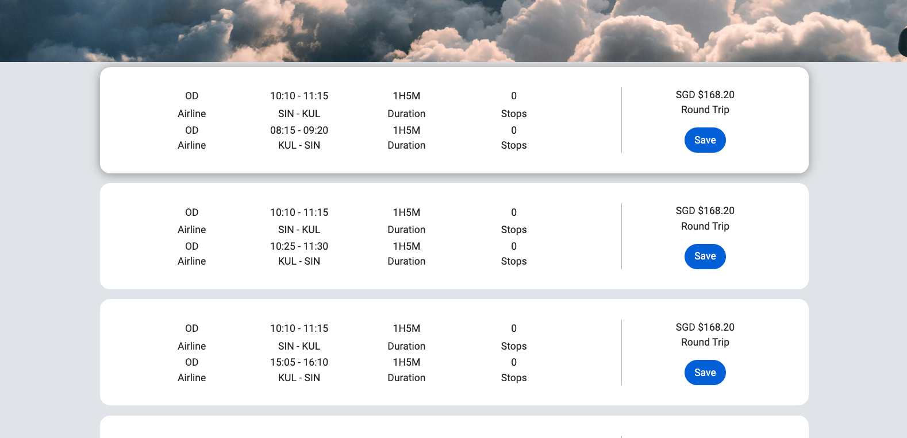
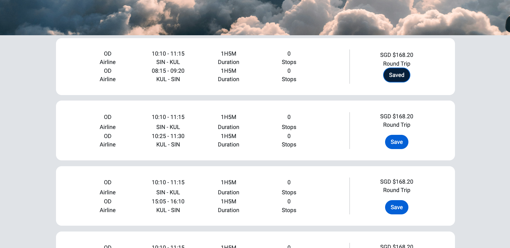
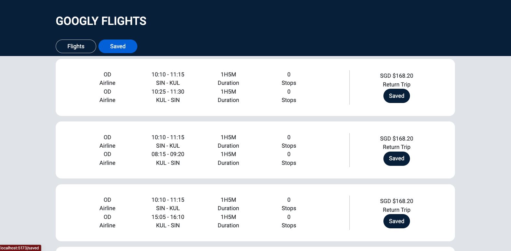

# Googly Flights Using React.js & APIs

## The Idea

I've always loved traveling and the thrill of finding the best flight deals. Platforms like Google Flights and SkyScanner have been my go-to tools, and I thought, "Why not build something similar myself?" That's how the idea for FlightFinder was born. My goal was to create an app that could fetch flight information based on user input and display it in an easy-to-understand format. Little did I know the challenges that lay ahead, especially with designing an intuitive search engine.



## Key Features

- Search flights easily: Input your origin, destination, departure date and return date to fetch a list of available flights.
- Price comparison: Quickly compare flight prices from various airlines to find the most cost-effective option for your journey.
- Flight information: View detailed information about each flight including departure and arrival times and flight duration.
- Save and shortlist flights: Save your favourite flights to a shortlist, allowing you to compare and review them later for easy decision-making.

## Technologies Used

- React.Js
- HTML5
- CSS3
- Airtable
- Amadeus Flights Offers Search API
- Amadeus City Search API

## How To Set Up & Run The Codes

1. Install TanStack Query - I used useQuery & useMutation for most of my API fetching.

```
npm i
npm i @tanstack/react-query
```

2. Install react router. This is necessary for the navigation bar and routing of pages.

```
npm react-router-dom
```

3. Go to https://developers.amadeus.com/ and sign up an account. You will need an API Key and API Secret. Refer to the instructions provided on the website.

4. Go to https://airtable.com/ and sign up an account. Go to the developer hub and create a token.

5. Create an .env file to store the amadeus' API key, API secret and airtable's token. Your .env file should have these:

The endpoints of the 2 amadeus APIs:

```
VITE_BASEURL="https://test.api.amadeus.com/v2/shopping/flight-offers?"

VITE_CITIES = "https://test.api.amadeus.com/v1/reference-data/locations/cities?"
```

API ID & Secret for the amadeus API:

```
VITE_ID= <replace with your own API ID>
VITE_SECRET= <replace with your own API secret>
```

Airtable's end point:

```
VITE_AIRTABLE= <replace with your own unique airtable end point>
```

Airtable's token:

```
VITE_ATTOKEN= <replace with your token id>
```

## The Search Engine - The Trickiest

From my experience as a user of flight comparison platforms, I knew that most people would type city names rather than specific airport names or airport codes. This posed a challenge since the API I was using only accepted airport IATA codes to fetch flight data and did not return any city name data. It just didn't feel right to have an empty input box, leaving users to search for the airport name separately and then come back to the app to enter the IATA code.

Inspired by how Google Flights works and following the typical user journey, I designed my search engine to follow a similar process:


(Reference: screenshot from Google Flights search bar)

1. Type the city name in the search bar.
2. A dropdown of possible airport suggestions appears.
3. The user clicks on the correct airport.
4. The input automatically corrects to display the full city name and airport code.

The solution seemed simple at first: provide a dropdown of airport suggestions as users type. However, implementing this feature was trickier than I anticipated.

### Making It User-Friendly

Here's how I achieved it:

1. **Fetching suggestions**

- As the user starts typing in the search bar, an **onChange** event triggers a call to the Amadeus City Search API.
- This API takes the input value and returns a list of airports along with their IATA codes. These populate the dropdown suggestions.



2. **Selecting an airport**

- When the user clicks on a suggested airport, another API (Amadeus Flights Offers Search) fetches the flight information based on the selected IATA code.

3. **Autofilling the inputs**

- One of my main concerns was ensuring the input field didn't just retain as the incomplete city name after selection. For example, if a user types "Singap" and selects Changi Airport (SIN), I wanted the input to autofill to "Singapore" instead of staying as "Singap".
- To achieve this, I used the Amadeus City Search API again to fetch the full city name based on the selected IATA code.



## The Search Results

Like any other flight comparison platform, my app retrieves and displays detailed flight information. The app fetches a variety of flight options based on the user's search parameters.



You might notice that some combinations appear to have the same price. This isn't an error; it's due to the way the API sorts and combines different departure and return trip options. Even if the prices are identical, there are actually slight differences in the options such as the return trips flight's info.

### Key Information Displayed

To make things simpler, the app only displays a maximum of 10 results. These results are focused on providing the lowest price flight combinations, to help users quickly find the best deals without being overwhelmed by too many options.

- Airline: The carrier operating the flight.
- Departure and Arrival Times: Exact times for both outbound and return flights.
- Flight Duration: Total time spent in the air.
- Price: The cost of the flight, sorted from lowest to highest for easy comparison.

In case you are wondering what those airlines are, they are actually the airline codes. Due to time constraints, I didn't manange to convert these codes into actual airline names or logo (the API I used doesn't provide airline logo). Hence, I left it as such.

## Saving & Shortlisting Flights

This process involves fetching flight data from the API, storing new saved flights, and retrieving and deleting saved flights in Airtable.

1. **Saving flights:**

- When users find a flight they want to save, they simply click on the "Save" button associated with that flight.
- The button, initially light blue, will then change to dark blue and display "Saved," indicating that the flight has been successfully added to their shortlist.

**In the "search results" page:**


2. **Accessing Saved Flights:**

- Users can view their saved flights by navigating to the "Saved" page within the app.
- Here, all the flights that have been shortlisted will be displayed, making it convenient for users to review their selections whenever they need.

**In the "saved" page:**


3. **Removing Shortlisted Flights:**

- If users decide they no longer want to keep a flight in their shortlist, they can simply click on the "Saved" button again.
- This action will remove the flight from their saved list.

## Future Developments

- **More filters:** Users have the flexibility to customize their search criteria, such as adjusting the number of travelers and selecting travel class, among other options. This can be easily managed by modifying parameters in the API endpoint.

- **Airport suggestion dropdown behavior:** Presently, the airport suggestion dropdown only closes if a user clicks on one of the suggestions. It does not automatically close if the user clicks elsewhere on the screen.

- **Autofill functionality for input:** Currently, the input autofill feature requires users to select an option from the suggestion dropdown. To improve usability, the system should autofill the input with the first suggestion when users click away without making a selection from the dropdown.

## Credits

- Unsplash for the cover image.
